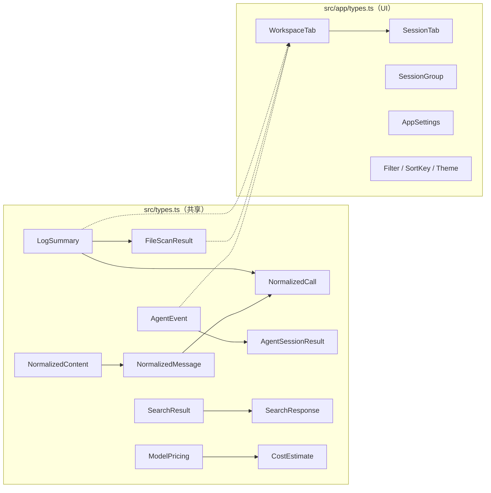
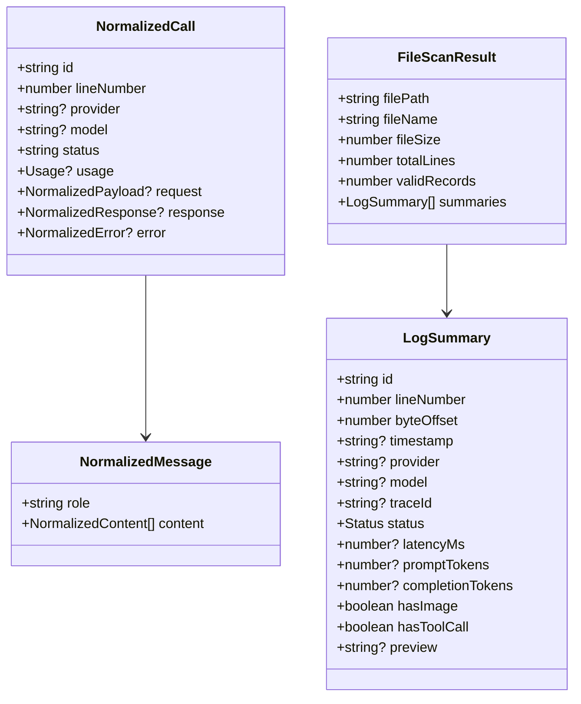

# TypeScript 类型

所有 TypeScript 类型定义在两个文件中：`src/types.ts`（共享/核心类型）和 `src/app/types.ts`（UI 特定类型）。

## 类型架构





## 核心类型 (`src/types.ts`)

📄 `src/types.ts`

### 状态和摘要

| 类型 | 描述 |
|------|-------------|
| `Status` | `"success" \| "error" \| "invalid_json" \| "unknown"` |
| `LogSummary` | 单个 JSONL 行的轻量级元数据 |
| `FileScanResult` | 完整 JSONL 扫描的结果 |
| `IncrementalScanResult` | 增量扫描的结果 |

#### LogSummary

```typescript
// file: src/types.ts:3-23
export type LogSummary = {
  id: string;
  lineNumber: number;
  byteOffset: number;
  timestamp?: string;
  provider?: string;
  model?: string;
  traceId?: string;
  sessionId?: string;
  requestId?: string;
  parentId?: string;
  status: Status;
  latencyMs?: number;
  promptTokens?: number;
  completionTokens?: number;
  totalTokens?: number;
  hasImage: boolean;
  hasToolCall: boolean;
  preview?: string;
  parseError?: string;
};
```

| 字段 | 类型 | 描述 |
|-------|------|-------------|
| `id` | `string` | 唯一记录标识符 |
| `lineNumber` | `number` | 文件中的 1 起始行号 |
| `byteOffset` | `number` | 用于 O(1) 寻址的字节偏移 |
| `timestamp?` | `string` | ISO 8601 时间戳 |
| `provider?` | `string` | LLM 提供商名称 |
| `model?` | `string` | 模型标识符 |
| `traceId?` | `string` | 跟踪标识符 |
| `sessionId?` | `string` | 会话标识符 |
| `requestId?` | `string` | 请求标识符 |
| `parentId?` | `string` | 父记录标识符 |
| `status` | `Status` | 记录状态 |
| `latencyMs?` | `number` | 响应延迟（毫秒） |
| `promptTokens?` | `number` | 输入 token 数 |
| `completionTokens?` | `number` | 输出 token 数 |
| `totalTokens?` | `number` | 总 token 数 |
| `hasImage` | `boolean` | 包含图片内容 |
| `hasToolCall` | `boolean` | 包含工具/函数调用 |
| `preview?` | `string` | 截断的文本预览 |
| `parseError?` | `string` | 解析失败时的错误消息 |

#### FileScanResult

```typescript
// file: src/types.ts:25-37
export type FileScanResult = {
  filePath: string;
  fileName: string;
  fileSize: number;
  modified?: string;
  totalLines: number;
  validRecords: number;
  invalidRecords: number;
  durationMs: number;
  cancelled: boolean;
  cacheHit: boolean;
  summaries: LogSummary[];
};
```

| 字段 | 类型 | 描述 |
|-------|------|-------------|
| `filePath` | `string` | 绝对文件路径 |
| `fileName` | `string` | 文件基本名称 |
| `fileSize` | `number` | 文件大小（字节） |
| `modified?` | `string` | 最后修改时间戳 |
| `totalLines` | `number` | 文件总行数 |
| `validRecords` | `number` | 成功解析的记录 |
| `invalidRecords` | `number` | 解析失败的记录 |
| `durationMs` | `number` | 扫描持续时间（毫秒） |
| `cancelled` | `boolean` | 扫描是否被取消 |
| `cacheHit` | `boolean` | 结果是否来自缓存 |
| `summaries` | `LogSummary[]` | 所有解析的摘要 |

#### IncrementalScanResult

```typescript
// file: src/types.ts:39-47
export type IncrementalScanResult = {
  summaries: LogSummary[];
  fileSize: number;
  modified?: string;
  nextLineNumber: number;
  validRecords: number;
  invalidRecords: number;
  durationMs: number;
};
```

### 规范化类型

```typescript
// file: src/types.ts:49-54
export type NormalizedContent =
  | { type: "text"; text: string }
  | { type: "image"; mime?: string; dataUrl?: string; data_url?: string; base64?: string }
  | { type: "tool_call"; name?: string; arguments?: unknown }
  | { type: "tool_result"; name?: string; result?: unknown }
  | { type: "unknown"; raw: unknown };
```

| 变体 | 字段 |
|---------|--------|
| `text` | `{ type: "text", text: string }` |
| `image` | `{ type: "image", mime?: string, dataUrl?: string, data_url?: string, base64?: string }` |
| `tool_call` | `{ type: "tool_call", name?: string, arguments?: unknown }` |
| `tool_result` | `{ type: "tool_result", name?: string, result?: unknown }` |
| `unknown` | `{ type: "unknown", raw: unknown }` |

#### NormalizedMessage

```typescript
// file: src/types.ts:56-60
export type NormalizedMessage = {
  role: "system" | "developer" | "user" | "assistant" | "tool" | "function" | "unknown";
  content: NormalizedContent[];
  raw?: unknown;
};
```

#### NormalizedCall

```typescript
// file: src/types.ts:62-99
export type NormalizedCall = {
  id: string;
  lineNumber: number;
  timestamp?: string;
  provider?: string;
  model?: string;
  traceId?: string;
  sessionId?: string;
  requestId?: string;
  parentId?: string;
  endpoint?: string;
  status: "success" | "error" | "unknown";
  latencyMs?: number;
  usage?: {
    promptTokens?: number;
    completionTokens?: number;
    totalTokens?: number;
  };
  request?: {
    messages?: NormalizedMessage[];
    raw?: unknown;
  };
  response?: {
    text?: string;
    messages?: NormalizedMessage[];
    toolCalls?: unknown;
    raw?: unknown;
  };
  error?: {
    message?: string;
    errorType?: string;
    type?: string;
    stack?: string;
    raw?: unknown;
  };
  metadata?: Record<string, unknown>;
  raw: unknown;
};
```

| 字段 | 类型 | 描述 |
|-------|------|-------------|
| `id` | `string` | 记录标识符 |
| `lineNumber` | `number` | 行号 |
| `timestamp?` | `string` | ISO 8601 时间戳 |
| `provider?` | `string` | LLM 提供商 |
| `model?` | `string` | 模型名称 |
| `traceId?` | `string` | 跟踪 ID |
| `sessionId?` | `string` | 会话 ID |
| `requestId?` | `string` | 请求 ID |
| `parentId?` | `string` | 父 ID |
| `endpoint?` | `string` | API 端点 |
| `status` | `"success" \| "error" \| "unknown"` | 调用状态 |
| `latencyMs?` | `number` | 延迟（毫秒） |
| `usage?` | `{ promptTokens?, completionTokens?, totalTokens? }` | Token 使用 |
| `request?` | `{ messages?: NormalizedMessage[], raw?: unknown }` | 请求负载 |
| `response?` | `{ text?, messages?, toolCalls?, raw? }` | 响应负载 |
| `error?` | `{ message?, errorType?, type?, stack?, raw? }` | 错误详情 |
| `metadata?` | `Record<string, unknown>` | 附加元数据 |
| `raw` | `unknown` | 原始 JSON |

### 搜索类型

```typescript
// file: src/types.ts:108-120
export type SearchResult = {
  lineNumber: number;
  byteOffset: number;
  context: string;
};

export type SearchResponse = {
  results: SearchResult[];
  truncated: boolean;
  cancelled: boolean;
  durationMs: number;
  indexed: boolean;
};
```

### 代理会话类型

```typescript
// file: src/types.ts:139-158
export type LogSource = "audit" | "codex" | "opencode" | "openclaw" | "claude_code" | "generic_agent";

export type AgentEventType =
  | "user_message"
  | "assistant_message"
  | "tool_call"
  | "tool_result"
  | "subagent_call"
  | "subagent_result"
  | "shell_command"
  | "file_read"
  | "file_write"
  | "patch"
  | "file_edit"
  | "checkpoint"
  | "plan_update"
  | "reasoning"
  | "error"
  | "system"
  | "unknown";
```

| 类型 | 描述 |
|------|-------------|
| `LogSource` | `"audit" \| "codex" \| "opencode" \| "openclaw" \| "claude_code" \| "generic_agent"` |
| `AgentEventType` | 17 种事件类型的联合 |
| `AgentEvent` | 代理会话中的单个事件 |
| `SubagentSession` | 按代理 ID 分组的子代理事件 |
| `AgentSessionResult` | 完整代理会话解析结果 |
| `AgentSessionIncrementalResult` | 增量代理会话结果 |

#### AgentEvent

```typescript
// file: src/types.ts:160-190
export type AgentEvent = {
  id: string;
  lineNumber: number;
  byteOffset: number;
  timestamp?: string;
  sessionId?: string;
  turnId?: string;
  parentId?: string;
  role?: string;
  eventType: AgentEventType | string;
  provider?: string;
  model?: string;
  toolName?: string;
  toolUseId?: string;
  subagentType?: string;
  subagentDescription?: string;
  subagentPrompt?: string;
  command?: string;
  filePaths: string[];
  status?: string;
  durationMs?: number;
  inputTokens?: number;
  outputTokens?: number;
  isError?: boolean;
  toolResultContent?: unknown;
  isSidechain?: boolean;
  agentId?: string;
  preview?: string;
  text?: string;
  raw: unknown;
};
```

### 定价类型

```typescript
// file: src/types.ts:209-222
export type ModelPricing = {
  model: string;
  provider: string;
  input_per_mtok: number;
  output_per_mtok: number;
};

export type CostEstimate = {
  model: string;
  input_cost: number;
  output_cost: number;
  total_cost: number;
  matched_pricing: string | null;
};
```

### 分析类型

```typescript
// file: src/types.ts:224-279
export type AnalyticsSummaryRaw = {
  total: number;
  success: number;
  errors: number;
  invalid: number;
  errorRate: number;
  p95Latency?: number;
  p99Latency?: number;
  totalTokens: number;
  p95Tokens?: number;
  topModels: NameCountRaw[];
  topProviders: NameCountRaw[];
};

export type NameCountRaw = {
  name: string;
  count: number;
};

export type IssueRecordRaw = {
  lineNumber: number;
  byteOffset: number;
  kind: string;
  message: string;
  severity: string;
  model?: string;
};

export type ComputedAnalyticsRaw = {
  analytics: AnalyticsSummaryRaw;
  issues: IssueRecordRaw[];
  sessions: SessionGroupRaw[];
  filterOptions: FilterOptionsRaw;
};
```

### 工具类型

```typescript
// file: src/types.ts:122-137
export type ProgressEvent = {
  processedBytes: number;
  totalBytes: number;
  lineNumber: number;
};

export type CacheInfo = {
  path: string;
  exists: boolean;
};

export type FileStatus = {
  exists: boolean;
  fileSize?: number;
  modified?: string;
};
```

## 应用类型 (`src/app/types.ts`)

📄 `src/app/types.ts`

### UI 状态类型

```typescript
// file: src/app/types.ts:11-30
export type Filter = "all" | "error" | "success" | "image" | "tool";
export type SortKey = "time" | "latency" | "tokens" | "model" | "status";
export type SortOrder = "desc" | "asc";
export type MessageViewMode = "preview" | "text" | "json";
export type LeftTab =
  | "records" | "timeline" | "subagents" | "agentFiles"
  | "trace" | "sessions" | "analytics" | "issues";
export type RightTab =
  | "diff" | "tools" | "error" | "raw" | "json";
export type Theme = "dark" | "light";
```

| 类型 | 值/描述 |
|------|-------------------|
| `Filter` | `"all" \| "error" \| "success" \| "image" \| "tool"` |
| `SortKey` | `"time" \| "latency" \| "tokens" \| "model" \| "status"` |
| `SortOrder` | `"desc" \| "asc"` |
| `MessageViewMode` | `"preview" \| "text" \| "json"` |
| `Theme` | `"dark" \| "light"` |
| `SessionTabKind` | `"main" \| "subagent"` |

#### LeftTab

| 值 | 面板 |
|-------|-------|
| `"records"` | 记录列表 |
| `"timeline"` | 时间线视图 |
| `"subagents"` | 子代理会话 |
| `"agentFiles"` | 代理文件浏览器 |
| `"trace"` | 跟踪视图 |
| `"sessions"` | 会话组 |
| `"analytics"` | 分析仪表板 |
| `"issues"` | 问题列表 |

#### RightTab

| 值 | 面板 |
|-------|-------|
| `"diff"` | 差异视图 |
| `"tools"` | 工具调用 |
| `"error"` | 错误详情 |
| `"raw"` | 原始 JSON |
| `"json"` | 解析的 JSON |

### 复杂应用类型

#### WorkspaceTab

```typescript
// file: src/app/types.ts:99-115
export type WorkspaceTab = {
  id: string;
  source: LogSource;
  file: FileScanResult;
  agentSession: AgentSessionResult | null;
  sessionTabs: SessionTab[];
  activeSessionTabId: string;
  providerFilter: string;
  modelFilter: string;
  statusFilter: string;
  issueOnly: boolean;
  traceFilter: string;
  lastSearchIndexed: boolean | null;
  newLineNumbers: number[];
  lastScanMs: number | null;
  lastSearchMs: number | null;
};
```

| 字段 | 类型 | 描述 |
|-------|------|-------------|
| `id` | `string` | 标签标识符 |
| `source` | `LogSource` | 日志源类型 |
| `file` | `FileScanResult` | 此标签的扫描结果 |
| `agentSession` | `AgentSessionResult \| null` | 代理会话数据 |
| `sessionTabs` | `SessionTab[]` | 此工作区内的子标签 |
| `activeSessionTabId` | `string` | 当前活动的子标签 |
| `providerFilter` | `string` | 活动的提供商过滤器 |
| `modelFilter` | `string` | 活动的模型过滤器 |
| `statusFilter` | `string` | 活动的状态过滤器 |
| `issueOnly` | `boolean` | 仅显示问题 |
| `traceFilter` | `string` | 活动的跟踪过滤器 |
| `lastSearchIndexed` | `boolean \| null` | FTS5 索引是否已构建 |
| `newLineNumbers` | `number[]` | 增量扫描的新行 |
| `lastScanMs` | `number \| null` | 上次扫描时间戳 |
| `lastSearchMs` | `number \| null` | 上次搜索时间戳 |

#### SessionGroup

```typescript
// file: src/app/types.ts:32-46
export type SessionGroup = {
  id: string;
  label: string;
  records: LogSummary[];
  startLine: number;
  endLine: number;
  startTime?: string;
  endTime?: string;
  provider: string;
  model: string;
  traceKey: string | null;
  errors: number;
  totalTokens: number;
  avgLatencyMs: number | null;
};
```

#### AppSettings

```typescript
// file: src/app/types.ts:79-83
export type AppSettings = {
  fontFamily: string;
  fontSize: number;
  codeFontFamily: string;
};
```

```typescript
// file: src/app/types.ts:156-160
export const DEFAULT_SETTINGS: AppSettings = {
  fontFamily: 'Inter, ui-sans-serif, system-ui, -apple-system, BlinkMacSystemFont, "Segoe UI", sans-serif',
  fontSize: 13,
  codeFontFamily: "ui-monospace, SFMono-Regular, Menlo, Consolas, monospace",
};
```

### 常量

```typescript
// file: src/app/types.ts:117-121
export const THEME_KEY = "promptlens.theme";
export const WORKSPACE_KEY = "promptlens.workspace";
export const SETTINGS_KEY = "promptlens.settings";
export const MESSAGE_VIEW_MODE_KEY = "promptlens.messageViewMode";
export const PANEL_WIDTH_KEY = "promptlens.panelWidth";
```

| 常量 | 值 | 用途 |
|----------|-------|---------|
| `THEME_KEY` | `"promptlens.theme"` | 主题的 localStorage 键 |
| `WORKSPACE_KEY` | `"promptlens.workspace"` | 工作区状态的 localStorage 键 |
| `SETTINGS_KEY` | `"promptlens.settings"` | 应用设置的 localStorage 键 |
| `MESSAGE_VIEW_MODE_KEY` | `"promptlens.messageViewMode"` | 消息视图模式的 localStorage 键 |
| `PANEL_WIDTH_KEY` | `"promptlens.panelWidth"` | 面板宽度的 localStorage 键 |
| `LEFT_MIN` | `260` | 左面板最小宽度（px） |
| `LEFT_MAX` | `560` | 左面板最大宽度（px） |
| `LEFT_DEFAULT` | `340` | 左面板默认宽度（px） |
| `RIGHT_MIN` | `300` | 右面板最小宽度（px） |
| `RIGHT_MAX_RATIO` | `0.6` | 右面板占窗口的最大比例 |
| `RIGHT_DEFAULT` | `400` | 右面板默认宽度（px） |
| `CENTER_MIN` | `200` | 中间面板最小宽度（px） |

### LogSource 选项

```typescript
// file: src/app/types.ts:123-130
export const LOG_SOURCE_OPTIONS: Array<{ value: LogSource; label: string }> = [
  { value: "audit", label: "Audit Log" },
  { value: "codex", label: "Codex" },
  { value: "opencode", label: "OpenCode" },
  { value: "openclaw", label: "OpenClaw" },
  { value: "claude_code", label: "Claude Code" },
  { value: "generic_agent", label: "Agent JSONL" },
];
```

| 值 | 标签 |
|-------|-------|
| `"audit"` | Audit Log |
| `"codex"` | Codex |
| `"opencode"` | OpenCode |
| `"openclaw"` | OpenClaw |
| `"claude_code"` | Claude Code |
| `"generic_agent"` | Agent JSONL |
