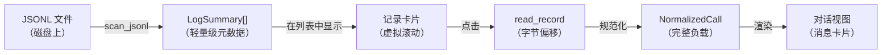
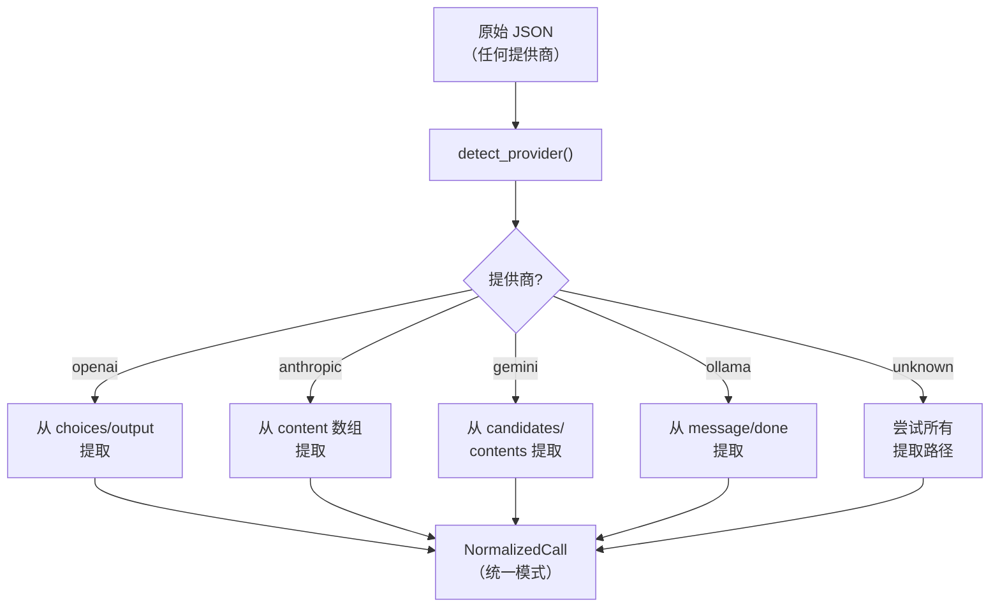
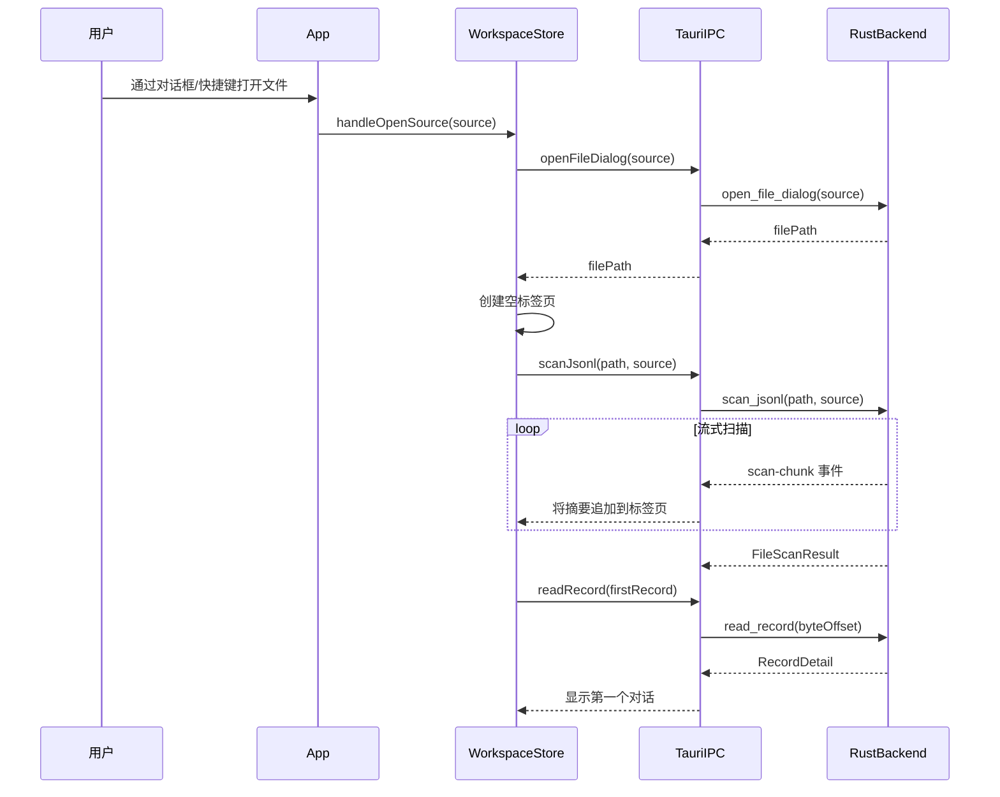
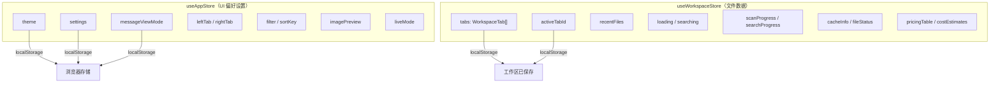

# 用户指南

本指南详细介绍了 PromptLens 的每一项功能。使用下方链接跳转到您需要的部分。

## 指南章节

| 章节 | 内容 |
|------|------|
| [界面概览](interface-overview.md) | 三面板布局、标题栏、标签页、调整手柄 |
| [打开文件](opening-files.md) | 菜单、键盘快捷键、最近文件、来源自动检测 |
| [浏览记录](browsing-records.md) | 虚拟列表、过滤、排序、记录卡片 |
| [查看对话](viewing-conversations.md) | 详情视图、消息卡片、视图模式、图片 |
| [工具调用](tool-calls.md) | ToolCallCard、ToolResultCard、右侧面板的工具标签页 |
| [搜索](search.md) | FTS5 搜索、子字符串搜索、正则搜索、上下文窗口 |
| [代理会话](agent-sessions.md) | 时间线、子代理、Codex/Claude Code 等的代理文件 |
| [分析](analytics.md) | 指标、图表、延迟直方图、成本估算 |
| [导出](export.md) | 过滤记录的六种导出格式 |
| [设置](settings.md) | 主题、字体、视图模式偏好 |
| [键盘快捷键](keyboard-shortcuts.md) | 参考表中的所有键盘快捷键 |

## 核心概念

### 记录与摘要

**记录**是 JSONL 文件中的单个 JSON 行。当 PromptLens 扫描文件时，它会为每条有效记录创建一个**摘要**。摘要包含提取的元数据（模型、提供商、令牌数、延迟、状态），无需加载完整的 JSON 负载。这使得记录列表即使对于大文件也能快速显示。

当您点击一条记录时，PromptLens 会在精确的字节偏移处读取原始 JSON，对其进行规范化，并显示完整的对话。



摘要类型在 Rust 和 TypeScript 中均有定义：

```rust
// file: src-tauri/src/types.rs:27-47
pub(crate) struct LogSummary {
    pub(crate) id: String,
    pub(crate) line_number: usize,
    pub(crate) byte_offset: u64,
    pub(crate) timestamp: Option<String>,
    pub(crate) provider: Option<String>,
    pub(crate) model: Option<String>,
    pub(crate) trace_id: Option<String>,
    pub(crate) session_id: Option<String>,
    pub(crate) request_id: Option<String>,
    pub(crate) parent_id: Option<String>,
    pub(crate) status: String,
    pub(crate) latency_ms: Option<u64>,
    pub(crate) prompt_tokens: Option<u64>,
    pub(crate) completion_tokens: Option<u64>,
    pub(crate) total_tokens: Option<u64>,
    pub(crate) has_image: bool,
    pub(crate) has_tool_call: bool,
    pub(crate) preview: Option<String>,
    pub(crate) parse_error: Option<String>,
}
```

```ts
// file: src/types.ts
export type LogSummary = {
  id: string;
  lineNumber: number;
  byteOffset: number;
  timestamp?: string;
  provider?: string;
  model?: string;
  traceId?: string;
  sessionId?: string;
  requestId?: string;
  parentId?: string;
  status: string;
  latencyMs?: number;
  promptTokens?: number;
  completionTokens?: number;
  totalTokens?: number;
  hasImage: boolean;
  hasToolCall: boolean;
  preview?: string;
  parseError?: string;
};
```

### 提供商规范化

PromptLens 自动检测每条记录由哪个 LLM 提供商生成。然后将数据规范化为具有一致字段的统一模式。规范化过程处理来自不同提供商的多种 JSON 结构：



规范化调用包含：

- `request.messages[]` -- 带有 `role` 和 `content` 的消息数组
- `response.messages[]` -- 响应消息
- `usage` -- 令牌计数（提示、完成、总计）
- `error` -- 调用失败时的错误详情

### 字节偏移随机访问

PromptLens 的关键设计决策之一是字节偏移索引。在扫描过程中，每条记录的字节偏移（从文件开始的位置）存储在摘要中：

```rust
// file: src-tauri/src/scanner.rs
// 扫描期间：
byte_offset += bytes_read as u64;
// 将 current_offset 存储在摘要中
```

当用户选择一条记录时，后端直接定位到该偏移处，仅读取一行：

```ts
// file: src/tauri.ts
export function readRecord(filePath: string, byteOffset: number, lineNumber: number) {
  return invoke<RecordDetail>("read_record", { filePath, byteOffset, lineNumber });
}
```

这提供了 O(1) 随机访问，无论文件大小如何 -- 无需读取前面的所有行。

### 工作区标签页

PromptLens 支持同时打开多个文件。每个文件在工作区中获得自己的标签页。每个标签页维护独立的状态：

- 选中的记录
- 过滤器和排序顺序
- 搜索结果
- 比较基线

通过点击标签页切换。右键点击标签页可获得关闭、关闭其他或关闭全部等选项。

```ts
// file: src/app/types.ts
export type WorkspaceTab = {
  id: string;
  source: LogSource;
  file: FileScanResult;
  agentSession: AgentSessionResult | null;
  sessionTabs: SessionTab[];
  activeSessionTabId: string;
  providerFilter: string;
  modelFilter: string;
  statusFilter: string;
  issueOnly: boolean;
  traceFilter: string;
  lastSearchIndexed: boolean | null;
  newLineNumbers: number[];
  lastScanMs: number | null;
  lastSearchMs: number | null;
};
```

### 会话标签页

在每个工作区标签页内，您可以打开**会话标签页**用于子代理对话。"Main"标签页显示主对话。当您在子代理视图中双击子代理时，它会在新的会话标签页中打开。

```tsx
// file: src/app/store.ts:316-330
handleSessionTabSwitch: (sessionTabId) => {
    set((s) => ({
      tabs: s.tabs.map((tab) => {
        if (tab.id !== s.activeTabId) return tab;
        if (sessionTabId !== "main" && !tab.sessionTabs.some((st) => st.id === sessionTabId)) {
          const agentId = sessionTabId.replace(/^subagent:/, "");
          const sub = tab.agentSession?.subagentSessions.find(
            (ss) => ss.agentId === agentId
          );
          if (sub) {
            const newTab: SessionTab = {
              id: sessionTabId,
              kind: "subagent",
              label: sub.description || sub.agentType || sub.agentId,
            };
            return {
              ...tab,
              sessionTabs: [...tab.sessionTabs, newTab],
              activeSessionTabId: sessionTabId,
            };
          }
        }
        return { ...tab, activeSessionTabId: sessionTabId };
      }),
    }));
},
```

## 文件加载流程

当打开文件时，完整加载序列如下：



## 典型工作流

### 调试失败的 API 调用

1. 打开您的 JSONL 审计日志。
2. 将过滤器设置为"Errors"以仅查看失败的调用。
3. 点击记录检查错误详情。
4. 检查右侧面板的 Error 标签页查看堆栈跟踪。
5. 使用 JSON 标签页检查原始请求负载。

### 比较模型输出

1. 打开包含多个模型的日志。
2. 点击来自模型 A 的记录上的比较图标（将其设为基线）。
3. 点击来自模型 B 的记录。
4. 切换到右侧面板的 Diff 标签页查看并排比较。

### 分析令牌成本

1. 打开您的审计日志。
2. 切换到分析标签页。
3. 查看总成本和平均成本指标卡片。
4. 检查模型条形图查看哪些模型使用最多令牌。
5. 导出为 CSV 以在电子表格中进行进一步分析。

### 监控实时日志

1. 打开仍在写入的日志文件。
2. 点击 Live 按钮启用实时模式。
3. PromptLens 监视文件并自动加载新记录。
4. 新记录在列表顶部显示"New"徽章。

### 检查代理会话

1. 使用 Open 菜单打开代理会话文件（Codex、Claude Code 等）。
2. 切换到时间线标签页按时间顺序查看所有事件。
3. 点击任何事件在中心面板查看详情。
4. 使用子代理标签页查看生成的子代理任务。
5. 双击子代理在新的会话标签页中打开其对话。
6. 使用代理文件标签页查看代理访问了哪些文件。

## 术语表

| 术语 | 定义 |
|------|------|
| **记录** | JSONL 文件中的单个 JSON 行 |
| **摘要** | 从记录中提取的元数据（模型、提供商、令牌数等） |
| **规范化调用** | 规范化为 PromptLens 统一模式的记录 |
| **字节偏移** | 记录在文件中的位置，以从文件开头的字节数表示 |
| **FTS5** | SQLite 的全文搜索扩展，用于内容搜索 |
| **工作区标签页** | 代表打开文件的标签页 |
| **会话标签页** | 代表工作区内子代理对话的标签页 |
| **Trace** | 由 trace 或 session ID 标识的一组相关 API 调用 |
| **代理事件** | 代理会话中的单个事件（消息、工具调用等） |
| **子代理** | 由主代理生成的子代理（例如 Claude Code Task 工具） |

## 错误处理

PromptLens 在每个级别都优雅地处理错误：

| 错误类型 | 处理方式 |
|---------|---------|
| 无效 JSON 行 | 在摘要中标记为 `invalid_json`；规范化时跳过 |
| 文件未找到 | 显示建议重新扫描的警告横幅 |
| 文件在磁盘上已更改 | 显示警告横幅，提供加载追加记录或重新扫描的选项 |
| 解析错误 | 错误消息显示在中心面板中，替代对话 |
| 网络错误 | 不适用（PromptLens 完全离线） |
| 大文件内存 | 虚拟滚动和按需加载防止内存问题 |

### 文件更改时的增量扫描

当 PromptLens 检测到文件在磁盘上已更改（通过 `FileWatcher`），它提供增量扫描，仅读取新字节：

```ts
// file: src/app/store.ts
handleLoadAppendedRecords: async () => {
  const file = tab.file;
  const result = await scanJsonlIncremental(
    file.filePath,
    file.fileSize,
    file.summaries.length
  );
  // 将新摘要追加到现有标签页
  get().updateActiveTab({
    file: {
      ...file,
      summaries: [...file.summaries, ...result.summaries],
      fileSize: result.fileSize,
      modified: result.modified,
    },
  });
},
```

## 应用状态架构

PromptLens 使用两个 Zustand store 来管理状态：



`useAppStore` 处理跨会话持久化的 UI 偏好设置。`useWorkspaceStore` 管理文件特定数据、标签页状态以及扫描和搜索等异步操作。

## LogSource 类型

PromptLens 支持多种来源类型，用于不同种类的 JSONL 文件：

```ts
// file: src/types.ts
export type LogSource =
  | "audit"          // 标准 LLM 审计日志
  | "codex"          // OpenAI Codex 代理会话
  | "claude_code"    // Claude Code 代理会话
  | "opencode"       // OpenCode 代理会话
  | "openclaw"       // OpenClaw 代理会话
  | "generic_agent"; // 通用代理 JSONL
```

来源类型决定使用哪个解析器和适配器来处理文件。通过 Open 菜单打开文件时，您需要显式选择来源类型。`detectLogSource` 命令也可以从 JSON 结构自动检测来源。

## 标签页上下文菜单

右键点击工作区标签页会显示上下文菜单：

| 操作 | 说明 |
|------|------|
| Close | 关闭标签页 |
| Close Others | 关闭除右键点击的标签页外的所有标签页 |
| Close All | 关闭所有标签页 |

## 记录卡片信息

列表中的每条记录卡片显示：

| 字段 | 来源 |
|------|------|
| 状态圆点 | 颜色编码：绿色（成功）、红色（错误）、灰色（无效） |
| 模型名称 | `LogSummary.model` |
| 提供商 | `LogSummary.provider` |
| 时间戳 | `LogSummary.timestamp` |
| 预览 | `LogSummary.preview`（第一条用户消息片段） |
| 延迟 | `LogSummary.latencyMs` |
| 令牌数 | `LogSummary.totalTokens` |
| 工具调用图标 | 当 `LogSummary.hasToolCall` 为 true 时显示扳手图标 |
| 图片图标 | 当 `LogSummary.hasImage` 为 true 时显示图片图标 |
| 成本 | 从定价表计算 |

## 虚拟滚动

记录列表使用虚拟滚动（通过 `@tanstack/react-virtual`）来高效处理大文件：


只有可见记录加上少量过度扫描缓冲区被渲染到 DOM 中，无论文件大小如何，内存使用量都保持恒定。

## 相关页面

- [界面概览](interface-overview.md) -- 布局和组件详情
- [打开文件](opening-files.md) -- 文件对话框和来源类型
- [浏览记录](browsing-records.md) -- 过滤、排序、记录卡片
