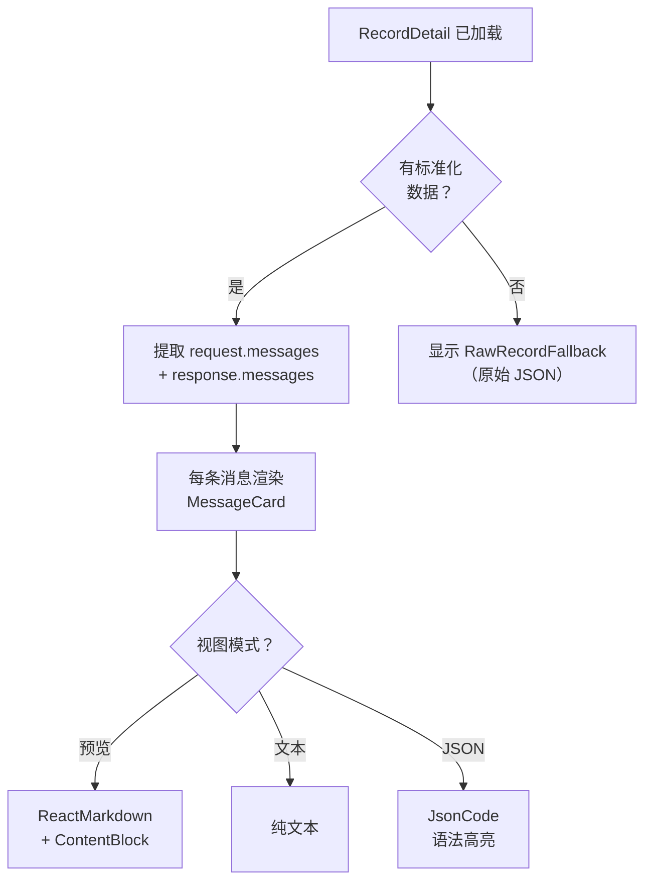

# 查看对话

中间面板显示选定记录的完整对话。它将请求和响应消息渲染为交互式卡片。

## 对话布局

当您选择一条记录时，中间面板显示：

1. **记录标题**，包含模型、提供商、行号、延迟和状态。
2. **错误卡片**（如果记录有错误）。
3. 来自 LLM API 请求的**请求消息**。
4. 来自 LLM API 响应的**响应消息**。



```
+----------------------------------------------------------+
| gpt-4.1                                                  |
| openai · line 42 · 234ms                           [OK]  |
+----------------------------------------------------------+
| [system]                                    [Copy][Preview][Text][JSON]|
| You are a helpful assistant.                               |
+----------------------------------------------------------+
| [user]                                      [Copy][Preview][Text][JSON]|
| What is the capital of France?                             |
+----------------------------------------------------------+
| [assistant]                                 [Copy][Preview][Text][JSON]|
| The capital of France is **Paris**. It has been...         |
+----------------------------------------------------------+
```

`DetailView` 组件是中间面板的入口点。它在渲染前检查代理事件、解析错误和规范化数据的存在：

```tsx
// file: src/app/components/CenterPanel.tsx:11
export const DetailView = memo(function DetailView({
  detail, selected, agentEvent, messageViewMode,
  onMessageViewModeChange, onImagePreview,
}) {
  if (!selected) return <div className="empty-state">Select a record to inspect its request and response.</div>;
  if (!detail) return <div className="empty-state">Loading record...</div>;
  if (detail.parseError) return <div className="record-error">{detail.parseError}</div>;
  if (agentEvent) return <AgentEventDetailView event={agentEvent} detail={detail} />;

  const requestMessages = detail.normalized?.request?.messages ?? [];
  const responseMessages = detail.normalized?.response?.messages ?? [];
  // ... 渲染消息
});
```

## 消息卡片

每张消息卡片（源码中称为 `MessageCard`）显示对话中的一条消息，带有角色指示器和操作按钮：

```tsx
// file: src/app/components/CenterPanel.tsx:299
export function MessageCard({ message, viewMode, onViewModeChange, onImagePreview }) {
  const isJson = viewMode === "json";
  return (
    <article className={`message-card role-${message.role}`}>
      <div className="message-role">
        <span>{message.role}</span>
        <div className="message-actions">
          <button onClick={() => copyJson(message.raw ?? message.content)} title="Copy message">
            <Copy size={14} />
          </button>
          <button className={viewMode === "preview" ? "active" : ""} onClick={() => onViewModeChange("preview")}>
            Preview
          </button>
          <button className={viewMode === "text" ? "active" : ""} onClick={() => onViewModeChange("text")}>
            Text
          </button>
          <button className={isJson ? "active" : ""} onClick={() => onViewModeChange("json")}>
            JSON
          </button>
        </div>
      </div>
      <div className="message-content">
        {isJson ? (
          <JsonCode value={message.raw ?? message.content} />
        ) : (
          message.content.map((content, index) => (
            <ContentBlock key={index} content={content} textMode={viewMode === "text"} onImagePreview={onImagePreview} />
          ))
        )}
      </div>
    </article>
  );
}
```

### 角色样式

每个角色通过 CSS 类 `role-${message.role}` 有不同的视觉样式：

| 角色 | 视觉处理 |
|------|----------|
| system | 微妙背景，较小文本 |
| developer | 类似 system |
| user | 标准背景 |
| assistant | 高亮背景 |
| tool | 工具结果的独特样式 |
| function | 遗留函数调用样式 |

角色值来自 `NormalizedMessage` 类型，在规范化期间填充：

```rust
// file: src-tauri/src/types.rs:240
pub(crate) struct NormalizedMessage {
    pub(crate) role: String,
    pub(crate) content: Vec<NormalizedContent>,
    pub(crate) raw: Option<Value>,
}
```

角色由 `normalize_role()` 函数规范化，确保跨提供商的一致值：

```rust
// file: src-tauri/src/adapters.rs:3
pub(crate) fn normalize_role(role: &str) -> String {
    match role {
        "system" | "developer" | "user" | "assistant" | "tool" | "function" => role.to_string(),
        "model" => "assistant".to_string(),
        _ => "unknown".to_string(),
    }
}
```

## 三种视图模式

每张消息卡片支持三种视图模式。模式在所有卡片间共享，由 `useAppStore` 中的 `messageViewMode` 状态管理。

### 预览模式（默认）

使用带 `remark-gfm` 的 `react-markdown` 将内容渲染为富文本输出：

```tsx
// file: src/app/components/CenterPanel.tsx:409
if (content.type === "text") {
  if (textMode) {
    return <pre className="plain-text-block">{content.text}</pre>;
  }
  return (
    <div className="markdown">
      <ReactMarkdown remarkPlugins={[remarkGfm]}>{content.text}</ReactMarkdown>
    </div>
  );
}
```

- **文本内容**渲染为支持 GitHub Flavored Markdown 的 Markdown（表格、删除线、任务列表）
- **图片**显示为可点击缩略图，在预览模态框中打开
- **工具调用**渲染为结构化的 `ToolCallCard` 组件
- **工具结果**渲染为可折叠的 `ToolResultCard` 组件

### 文本模式

将所有文本内容渲染为 `<pre>` 块中的纯文本。无 Markdown 渲染。适用于复制原始文本或检查空白字符。

### JSON 模式

使用自定义基于正则的标记器将整个消息对象渲染为语法高亮的 JSON：

```tsx
// file: src/app/analytics.ts:435
export function highlightJson(json: string) {
  return json.replace(
    /("(?:\\.|[^"\\])*")\s*:/g,
    '<span class="json-key">$1</span>:',
  );
}
```

`JsonCode` 组件对不同的 JSON 值类型应用颜色类：

```tsx
// file: src/app/analytics.ts:442
export function jsonScalarClass(value: unknown) {
  if (typeof value === "number") return "json-number";
  if (typeof value === "boolean") return "json-boolean";
  if (value === null) return "json-null";
  return "json-string";
}
```

| 令牌类型 | CSS 类 | 颜色（深色主题） |
|----------|--------|-----------------|
| 对象键 | `json-key` | 蓝色 |
| 字符串 | `json-string` | 绿色 |
| 布尔值 | `json-boolean` | 紫色 |
| Null | `json-null` | 灰色 |
| 数字 | `json-number` | 橙色 |

## 内容类型

每条消息包含一个**内容部分**数组（`NormalizedContent`）。PromptLens 处理五种内容类型，定义为 Rust 枚举：

```rust
// file: src-tauri/src/types.rs:247
#[derive(Debug, Serialize, Deserialize)]
#[serde(tag = "type", rename_all = "snake_case")]
pub(crate) enum NormalizedContent {
    Text { text: String },
    Image { mime: Option<String>, data_url: Option<String>, base64: Option<String> },
    ToolCall { name: Option<String>, arguments: Option<Value> },
    ToolResult { name: Option<String>, result: Option<Value> },
    Unknown { raw: Value },
}
```

### 文本内容

```json
{ "type": "text", "text": "Hello, how can I help?" }
```

### 图片内容

```json
{
  "type": "image",
  "mime": "image/png",
  "dataUrl": "data:image/png;base64,..."
}
```

图片检测在后端（规范化期间）和前端都发生。后端使用 `image_detector` 模块检测各种格式的 base64 编码图片：

```rust
// file: src-tauri/src/parser/image_detector.rs
// 检测 PNG (iVBOR)、JPEG (/9j/)、GIF (R0lGOD)、WebP (UklGR) 魔术字节
// 也检测 data:image/*;base64, 前缀字符串
```

前端提供 `imageDataUrlFromString()` 用于内容中的额外图片检测：

```tsx
// file: src/app/analytics.ts:449
export function imageDataUrlFromString(value: string): string | null {
  if (value.startsWith("data:image/")) return value;
  return null;
}
```

### 工具调用内容

```json
{
  "type": "tool_call",
  "name": "get_weather",
  "arguments": { "city": "Paris" }
}
```

### 工具结果内容

```json
{
  "type": "tool_result",
  "name": "get_weather",
  "result": { "temp": "18°C", "condition": "cloudy" }
}
```

## 代理事件详情视图

在查看代理会话并在时间线中选择事件时，中间面板显示**代理事件详情视图**，其部分根据事件类型自适应：

```tsx
// file: src/app/components/CenterPanel.tsx:105
function AgentEventDetailView({ event, detail }) {
  const output = rawTxtByKeys(event.raw, ["output", "stdout", "stderr", "result"]);
  const reasoning = event.eventType === "reasoning"
    ? event.text || rawTxtByKeys(event.raw, ["thinking", "summary", "reasoning"])
    : null;
  const toolInput = rawValByKeys(event.raw, ["input", "arguments", "args", "parameters"]);
  const toolResult = rawValByKeys(event.raw, ["result", "output", "content", "stdout", "stderr"]);
  // ... 根据事件类型渲染各部分
}
```

`rawValByKeys` 和 `rawTxtByKeys` 辅助函数递归搜索嵌套 JSON 对象中的键，实现跨不同代理格式的灵活提取：

```tsx
// file: src/app/analytics.ts:359
export function rawValueByKeys(obj: unknown, keys: string[]): unknown {
  if (typeof obj !== "object" || obj === null) return undefined;
  for (const key of keys) {
    if (key in (obj as Record<string, unknown>)) return (obj as Record<string, unknown>)[key];
  }
  for (const value of Object.values(obj as Record<string, unknown>)) {
    const found = rawValueByKeys(value, keys);
    if (found !== undefined) return found;
  }
  return undefined;
}
```

| 部分 | 内容 |
|------|------|
| **摘要网格** | 提供商、模型、角色、状态、持续时间、令牌、轮次 ID、父 ID、工具使用 ID、子代理类型、代理 ID |
| **推理** | 推理事件显示模型的内部推理文本 |
| **命令** | Shell 命令事件显示命令及其输出 |
| **子代理调用** | 子代理事件显示子代理类型、描述和提示 |
| **工具结果** | 结构化输出（stdout、stderr、文件内容） |
| **文件** | 事件中引用的文件路径列表 |
| **文件预览** | 文件读取/写入/编辑/补丁事件显示内容或差异 |
| **原始事件** | 事件的完整原始 JSON |

## 回退：原始记录视图

如果 PromptLens 无法从记录中解析消息（无规范化数据），它回退到原始视图，尝试从原始 JSON 中提取请求和响应载荷：

```tsx
// file: src/app/components/CenterPanel.tsx:87
function RawRecordFallback({ detail }) {
  const request = detail.normalized?.request?.raw
    ?? rawValByKeys(detail.raw, ["request", "input", "prompt", "messages"]);
  const response = detail.normalized?.response?.raw
    ?? rawValByKeys(detail.raw, ["response", "output", "completion", "result"]);
  return (
    <div className="raw-fallback">
      <section className="agent-detail-section">
        <h2>Raw Request</h2>
        <JsonCode value={request ?? "No request payload found."} />
      </section>
      <section className="agent-detail-section">
        <h2>Raw Response</h2>
        <JsonCode value={response ?? "No response payload found."} />
      </section>
    </div>
  );
}
```

## 复制内容

| 复制内容 | 方法 |
|----------|------|
| 单条消息 | 点击消息卡片上的复制按钮 |
| 完整记录 JSON | 按 `Ctrl+Shift+C` |
| 文本内容 | 切换到文本模式，手动选择并复制 |
| 图片 | 在预览模态框中右键点击图片 |

`Ctrl+Shift+C` 快捷键复制当前选中记录的原始 JSON：

```tsx
// file: src/app/App.tsx:206
if (mod && event.shiftKey && event.key.toLowerCase() === "c") {
  event.preventDefault();
  void copyJson(detail?.raw);
}
```

## 记录加载管道

选择记录时，前端调用 `read_record`，该命令定位到字节偏移并解析单行 JSON：

```rust
// file: src-tauri/src/commands.rs:106
fn read_record(
    file_path: String,
    byte_offset: u64,
    line_number: usize,
) -> Result<RecordDetail, String> {
    let file = File::open(&file_path)?;
    let mut reader = BufReader::new(file);
    reader.seek(SeekFrom::Start(byte_offset))?;
    let mut line = String::new();
    reader.read_line(&mut line)?;
    // 解析 JSON，规范化，返回 RecordDetail
}
```

`RecordDetail` 包含摘要、规范化调用和原始 JSON：

```rust
// file: src-tauri/src/types.rs:66
pub(crate) struct RecordDetail {
    pub(crate) summary: LogSummary,
    pub(crate) normalized: Option<NormalizedCall>,
    pub(crate) raw: Option<Value>,
    pub(crate) parse_error: Option<String>,
}
```

这种按字节偏移的 O(1) 定位设计意味着在多 GB 文件中选择任何记录都是瞬时的。
