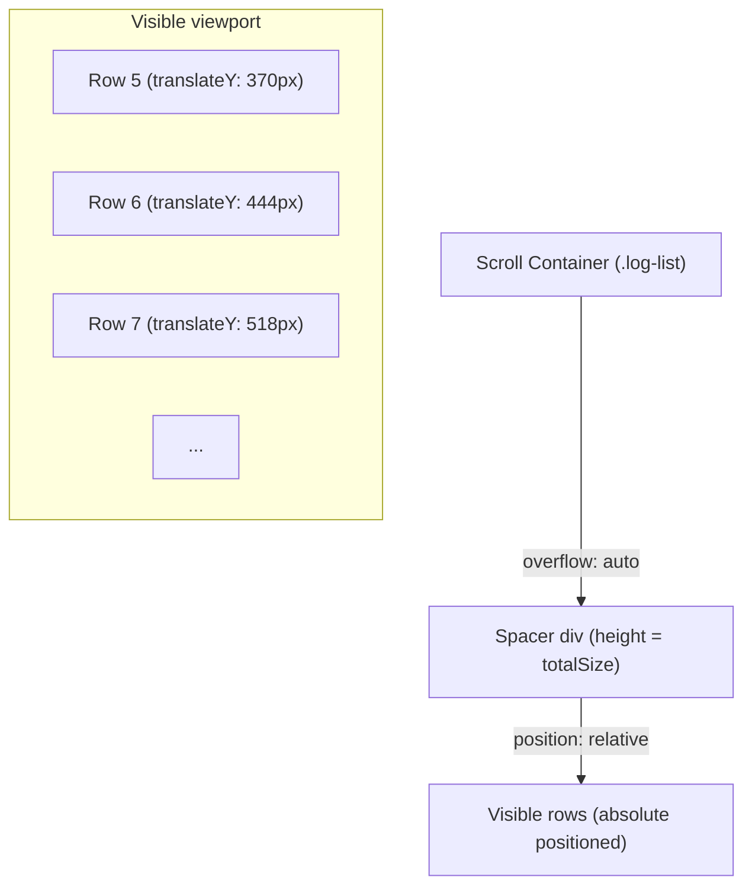
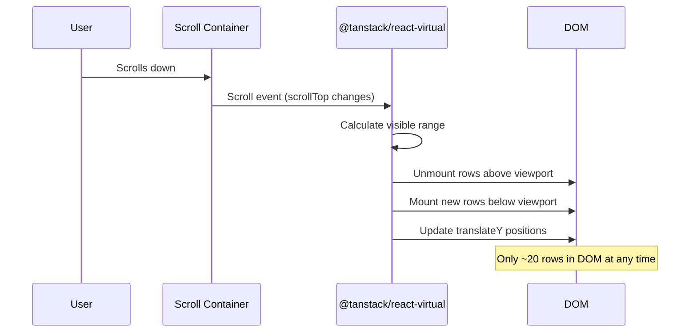
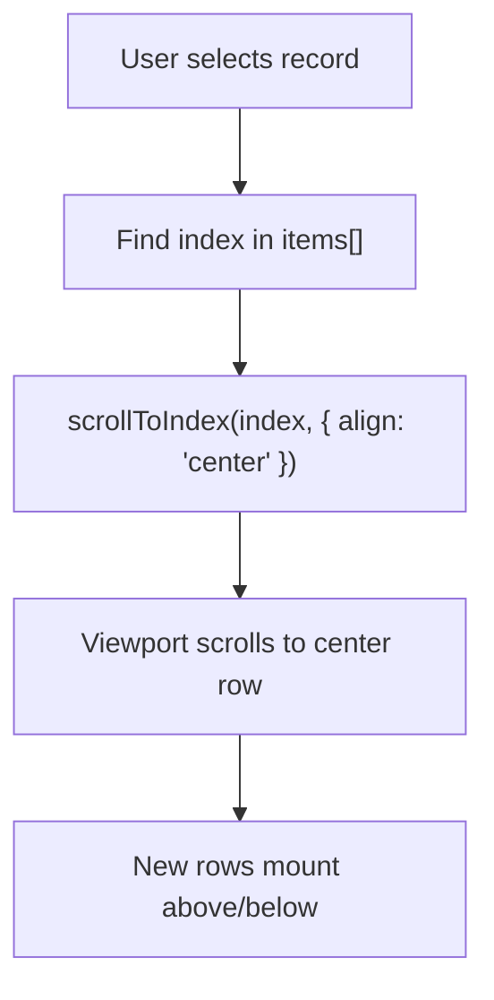
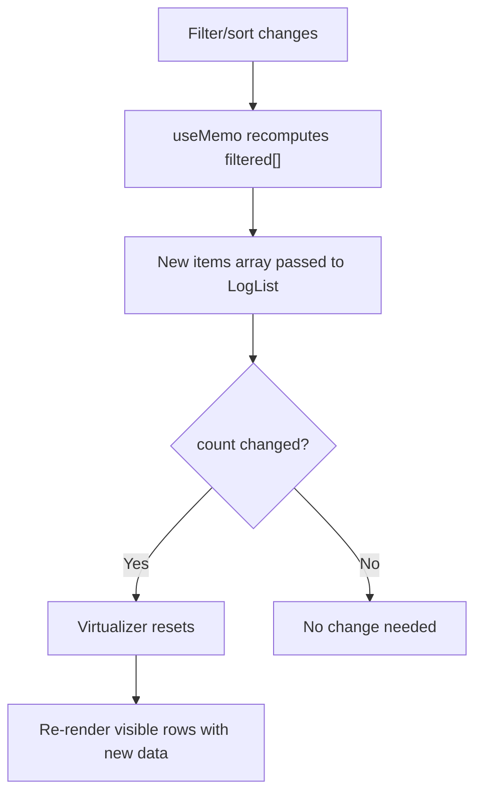
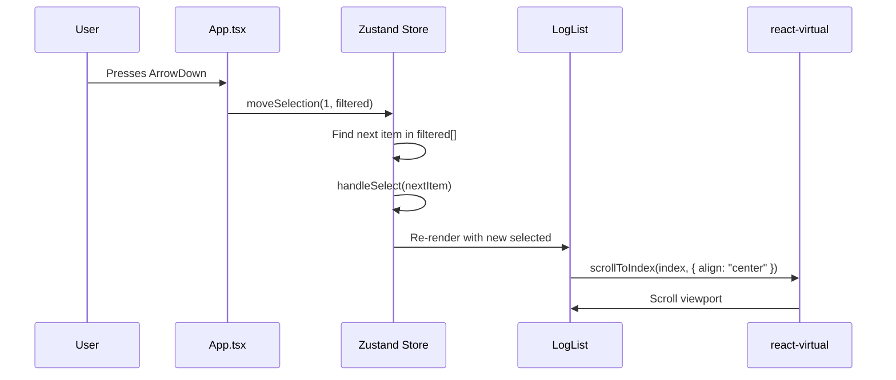

# 虚拟滚动

PromptLens 必须处理包含数万条记录的 JSONL 文件。将每条记录渲染为 DOM 节点会导致浏览器冻结。解决方案是虚拟滚动：任何时间只有可见的行存在于 DOM 中。

## 为什么需要虚拟滚动？

典型的 LLM 审计日志可能包含 10,000-100,000 行 JSON。日志列表中的每条记录行具有固定的 74px 高度，包含：

- 状态圆点、模型名称、时间戳（顶行）
- 提供商、延迟、token 数、成本、图标（元数据行）
- 预览文本（底行）

| 记录数 | DOM 节点（无虚拟化） | DOM 节点（有虚拟化） | 内存影响 |
|---------|-------------------------------|--------------------------------|---------------|
| 1,000 | ~3,000 | ~60-75 | 差异不大 |
| 10,000 | ~30,000 | ~60-75 | 无虚拟化时有明显延迟 |
| 50,000 | ~150,000 | ~60-75 | 无虚拟化时浏览器冻结 |
| 100,000 | ~300,000 | ~60-75 | 无虚拟化时无法使用 |

使用虚拟化后，无论总数多少，任何时间只有约 15-20 行被挂载。

## 库：@tanstack/react-virtual

PromptLens 使用 `@tanstack/react-virtual` v3.13（来自 TanStack 家族）。选择它而非 `react-window` 或 `react-virtuoso` 等替代方案，因为：

| 库 | 优点 | 缺点 |
|---------|------|------|
| **@tanstack/react-virtual**（已选择） | TanStack 维护，轻量（~3KB），灵活 API，`scrollToIndex()` | 较新，社区较小 |
| react-window | 成熟，广泛使用 | 无动态高度，API 较不灵活 |
| react-virtuoso | 自动高度，智能滚动 | 较重（~10KB），API 较为固化 |

## 实现

虚拟列表在 `src/app/components/LeftPanel.tsx` 中的 `LogList` 组件中实现。

### 设置

```tsx
// file: src/app/components/LeftPanel.tsx:2
import { useVirtualizer } from "@tanstack/react-virtual";

function LogList({ items, selected, ... }) {
  const parentRef = useRef<HTMLDivElement | null>(null);

  const rowVirtualizer = useVirtualizer({
    count: items.length,           // 项目总数
    getScrollElement: () => parentRef.current,  // 滚动容器
    estimateSize: () => 74,        // 估计行高（px）
    overscan: 10,                  // 视口上方/下方渲染的额外行数
  });

  return (
    <div ref={parentRef} className="log-list">
      <div style={{
        height: rowVirtualizer.getTotalSize(),  // 总可滚动高度
        position: "relative",
      }}>
        {rowVirtualizer.getVirtualItems().map((virtualRow) => {
          const item = items[virtualRow.index];
          return (
            <button
              key={`${item.id}-${item.lineNumber}`}
              className="log-row"
              style={{
                transform: `translateY(${virtualRow.start}px)`,
              }}
            >
              {/* 行内容 */}
            </button>
          );
        })}
      </div>
    </div>
  );
}
```

### 工作原理



1. 渲染一个 `div` 作为间隔器，`height` 等于 `count * estimatedSize`（例如 50,000 * 74 = 3.7M 像素）。这创建了正确的滚动条。
2. 只有在视口中可见的行（加上上下各 10 个 overscan 行）被渲染。
3. 每行使用 `transform: translateY(virtualRow.start)` 绝对定位。
4. 当用户滚动时，`react-virtual` 重新计算哪些行可见并挂载/卸载它们。



### 关键配置

| 参数 | 值 | 用途 |
|---|---|---|
| `count` | `items.length` | 过滤后的记录总数 |
| `estimateSize` | `74` | 匹配 CSS `.log-row { height: 74px }` 的固定行高 |
| `overscan` | `10` | 视口上/下各 10 行额外缓冲，实现平滑滚动 |

`overscan` 值为 10 意味着任何时间大约渲染 15-25 行（5-15 行可见 + 10 行缓冲）。这提供了平滑滚动而无可见的弹出。

### 自动滚动到选中记录

当用户选择一条记录（通过点击或键盘导航）时，虚拟器滚动使其居中：

```tsx
// file: src/app/components/LeftPanel.tsx（近似）
useEffect(() => {
  if (!selected) return;
  const index = items.findIndex((item) => isSameLine(item, selected));
  if (index >= 0) {
    rowVirtualizer.scrollToIndex(index, { align: "center" });
  }
}, [items, rowVirtualizer, selected]);
```

`align: "center"` 选项滚动视口使选中行垂直居中。



## 虚拟行的 CSS

`src/styles/list.css` 中的 CSS 设计为与绝对定位配合使用：

```css
/* file: src/styles/list.css（近似） */
.log-list {
  height: calc(100% - 58px);  /* 填充文件标题下方的剩余空间 */
  overflow: auto;              /* 这是滚动容器 */
}

.log-row {
  position: absolute;          /* 由 react-virtual 定位 */
  left: 0;
  width: 100%;
  height: 74px;                /* 必须匹配 estimateSize */
  padding: 10px 14px;
  border: 0;
  border-bottom: 1px solid var(--glass-border);
  background: transparent;
  cursor: pointer;
  transition: background 120ms var(--ease);
}

.log-row:hover {
  background: var(--glass-bg-hover);
}

.log-row.selected {
  background: var(--surface-selected);
  box-shadow: inset 3px 0 0 var(--accent);
}
```

`.log-row` 上的固定 `height: 74px` 至关重要 -- 它必须精确匹配 `estimateSize` 值。如果不匹配，行会重叠或留下间隙。

### 为什么使用 position: absolute + translateY？

`position: absolute` 和 `transform: translateY()` 方法避免了布局抖动：

| 方法 | 行为 | 性能 |
|----------|----------|-------------|
| **absolute + translateY**（已选择） | 每行独立定位 | 无兄弟元素重计算 |
| relative + margin-top | 行互相推挤 | 挂载/卸载时完全重排布局 |
| flexbox | 行自然流动 | 对 50k+ 项开销大 |

使用绝对定位时，挂载/卸载一行对兄弟位置零影响。浏览器只需绘制变化的行，无需重算整个列表布局。

## 性能特征

| 指标 | 无虚拟化 | 有虚拟化 |
|---|---|---|
| DOM 节点（50k 记录） | ~150,000 | ~60-75 |
| 初始渲染 | 500ms+ | &lt;50ms |
| 内存 | 200MB+ | ~20MB |
| 滚动性能 | 卡顿（丢帧） | 60fps |
| 过滤/排序 | 完全 DOM diff | 几乎瞬时 |

## 过滤和排序交互

当用户更改过滤器或排序顺序时，传递给 `LogList` 的 `items` 数组发生变化。虚拟器因为 `count` 变化而自动重置：

```typescript
// 在 App.tsx 中
const filtered = useMemo(() => {
  return [...file.summaries]
    .filter((item) => { /* ... */ })
    .sort((a, b) => compareSummary(a, b, sortKey));
}, [file, filter, sortKey, query, ...]);

// 传递给 LeftPanel -> LogList
<LogList items={records} ... />
```

`LogList` 组件接收已过滤和排序的数组。虚拟器简单地以新计数重新渲染。无需手动重置。



## 增量记录

当通过增量扫描追加新记录时，它们显示为带有"New"徽章和绿色高亮：

```tsx
const newLineSet = useMemo(() => new Set(newLineNumbers), [newLineNumbers]);

// 在行渲染器中
const isNew = newLineSet.has(item.lineNumber);
return (
  <button className={`log-row ${isNew ? "new-record" : ""}`}>
    {isNew ? <span className="new-badge">New</span> : null}
    {/* ... */}
  </button>
);
```

`newLineNumbers` 数组按工作区标签追踪，在用户选择新记录时清除。

## 行结构

每个虚拟行是一个 `<button>` 元素，包含三个视觉层：

```tsx
<button className="log-row" style={{ transform: `translateY(${virtualRow.start}px)` }}>
  <div className="row-top">
    <span className={`status-dot ${item.status}`} />   {/* 绿/红圆点 */}
    {isNew ? <span className="new-badge">New</span> : null}
    <span className="model">{item.model}</span>         {/* 模型名称 */}
    <span className="time">{formatTime(item.timestamp)}</span>
  </div>
  <div className="row-meta">
    <span>{item.provider}</span>                        {/* 提供商名称 */}
    <span>{formatLatency(item.latencyMs)}</span>        {/* 延迟 */}
    <span>{formatTokens(item.totalTokens)}</span>       {/* token 数 */}
    {cost > 0 ? <span className="cost">${cost}</span> : null}
    {item.hasImage ? <Image size={14} /> : null}        {/* 图片图标 */}
    {item.hasToolCall ? <Wrench size={14} /> : null}    {/* 工具图标 */}
    <span className="row-compare"><GitCompare size={13} /></span>
  </div>
  <div className="preview">{item.preview}</div>         {/* 截断文本 */}
</button>
```

74px 的行高足以容纳所有三层及内边距。

## 键盘导航

记录可以用方向键导航。workspace store 中的 `moveSelection` action 在过滤数组中将选择移动 +1 或 -1：

```typescript
// 在 App.tsx 键盘处理器中
if (event.key === "ArrowDown") {
  event.preventDefault();
  ws().moveSelection(1, filtered);
}
if (event.key === "ArrowUp") {
  event.preventDefault();
  ws().moveSelection(-1, filtered);
}
```

```typescript
// 在 store 中
moveSelection: (delta, filtered) => {
  const index = filtered.findIndex((item) => item.id === selected.id);
  const next = filtered[Math.max(0, Math.min(filtered.length - 1, index + delta))];
  if (next && next.id !== selected.id) void get().handleSelect(next);
},
```

当 `handleSelect` 更新 `selected` 值时，`LogList` 中的 `useEffect` 触发并调用 `scrollToIndex(index, { align: "center" })`。



## 局限性

| 局限性 | 当前状态 | 潜在解决方案 |
|-----------|---------------|-------------------|
| 仅支持固定行高 | 所有行都是 74px | 使用 `measureElement` 实现动态高度 |
| 无水平虚拟化 | 每行渲染所有内容 | 不需要 -- 行很紧凑 |
| 无无限滚动 | 完整过滤数组在内存中 | 基于游标的加载（后端通过字节偏移支持） |
| 过滤时丢失滚动位置 | 过滤变化时重置到顶部 | 按过滤状态保存/恢复滚动位置 |

- **仅支持固定行高**：当前实现假设所有行恰好 74px。如果行内容高度可变，`estimateSize` 需要返回测量高度。
- **无水平虚拟化**：每行渲染所有内容。对于极宽数据，这不是问题，因为行很紧凑。
- **无无限滚动**：完整的过滤数组在内存中。对于百万级记录的文件，需要基于游标的加载策略（Rust 后端通过字节偏移支持此功能，但前端尚未实现）。
- **过滤时丢失滚动位置**：当过滤器变化导致数组缩小时，滚动位置重置到顶部。选中项可能滚动出视野，直到用户导航到它。
